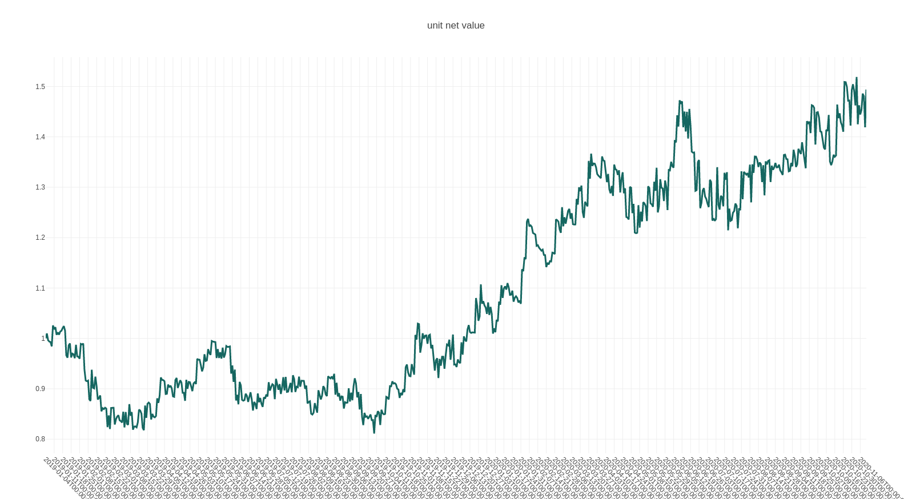

|CI status|
================
sharpe
================

**sharpe** is a unified, interactive, general-purpose environment for backtesting or applying machine learning(supervised learning and reinforcement learning) in the context of quantitative trading.

it's designed to allow maximum flexibility and simplicity in the practical research process: raw financial data -> feature engineering -> model training -> trading strategy -> backtesting, come in the reasonable level of abstraction.

**core features:**

* unified: unify the supervised learning and reinforcement learning in a framework.
* interactive: state(feature) -> action(portfolio-weight) -> reward(profit-and-loss/returns) bar-by-bar, allow maximum workflow control.
* general-purpose: market-independent, instrument-independent, trading-frequency-independent.

..
  
  *sharpe* is considered in early alpha release. Stuff might break.

outline
-----------

.. contents:: Table of Contents
    :local: 

* `1 Motivation and concept design <#1-Motivation and concept design>`_

* `2 Install <#2-Install>`_

* `3 Quick Start <#3-Quick Start>`_

* `4 Documentation <#4-Documentation>`_

* `5 Examples <#5-Examples>`_

* `6 Communication & Contributing <#6-Communication & Contributing>`_

* `7 Acknowledgements <#7-Acknowledgements>`_

1 Motivation and concept design
--------------------------------------
Before we walk through an end-to-end example how to backtest a trading stratey with **sharpe**, let’s take a step back and discuss and understand the difficuties encountering when design a backtest engine for quantitative trading, the answer derives from
quantitative researchers own different types of trading philosophy, trade different types of instruments in different markets with different trading frequencies. 

* **different types of trading philosophy**: rule-based methodology versus factor-based methodology(supervised learning versus reinforcement learning)
* **different types of instruments in different market**: stock, index, ETF, future in different countries and markets.
* **different trading frequencies**: intra-day trading(seconds, minutes, hours) and inter-day trading(daily, weekly, montly)

trading decison can be viewed as a special case of sequential decision-making, which can be formalized as follows: at each timestamp
 
* a agent sees a observation of the state of the environment, that the agent lives in and interacts with
* and then decides on an action to take, based on a policy(can be also called strategy, a mapping from state to action)
* The agent perceives a reward signal from the environment, a number that tells it how good or bad the current action is
* sees the observation of the next state, and iteratively

The goal of the agent is to find a good policy(strategy) to maximize its cumulative reward.

following this concept framwork, *sharpe* re-conceptualizes the process of trading and provides research with low-level, common tool to develop and backtest trading strategy.

2 Install
--------------------

.. code-block:: bash

    $ git clone https://github.com/StateOfTheArt-quant/sharpe
    $ cd sharpe
    $ python setup.py install

3 Quick Start
--------------------
The following snippet showcases the whole workflow of trading strategy development in *sharpe*.

.. code:: python
     
     from sharpe.utils.mock_data import create_toy_feature
     from sharpe.data.data_source import DataSource
     from sharpe.environment import TradingEnv
     from sharpe.mod.sys_account.api import order_target_weights
     import random
     random.seed(111)
     
     feature_df, price_s = create_toy_feature(order_book_ids_number=2, feature_number=3, start="2020-01-01", end="2020-01-11", random_seed=111)
     data_source = DataSource(feature_df=feature_df, price_s=price_s)

     env= TradingEnv(data_source=data_source, look_backward_window=4, mode="rl")
     print('----------------------------------------------------------------------')
     
     company_id = "000001.XSHE"

     def your_strategy(state):
          """
          here is a random strategy, only trade the first stock with a random target percent
          """

          target_percent_of_position =  round(random.random(),2)
          target_position_dict = {company_id : target_percent_of_position}
          print("the target portfolio is to be: {}".format(target_position_dict))
          # call trade API
          action = order_target_weights(target_position_dict)
          return action

     state = env.reset()

     while True:
          print("the current trading_dt is: {}".format(env.trading_dt))
          action = your_strategy(state)
          
          next_state, reward, done, info = env.step(action)
          print("the reward of this action: {}".format(reward))
          print("the next state is \n {}".format(next_state))
          if done:
               break
          else:
               state = next_state
    env.render()

4 Documentation
----------------------

* API documentation and an overview of the library: `https://sharpe.readthedocs.io/en/latest/ <https://sharpe.readthedocs.io/en/latest/>`_

5 Examples
----------------------
* `risk parity strategy <example/rule-based-strategy/risk_parity_strategy.py>`_

6 Communication & Contributing
-----------------------------------

* email: yujiangallen@126.com

Working on your first Pull Request? You can learn how from this free series `How to Contribute to an Open Source Project on GitHub <https://egghead.io/courses/how-to-contribute-to-an-open-source-project-on-github>`_

7 Acknowledgements
----------------------
*sharpe* derived from our initial project `trading_gym <https://github.com/StateOfTheArt-quant/trading_gym>`_, which now is a event-driven(or observer) design pattern, the code highly inspired by `RQALPHA <https://github.com/ricequant/rqalpha>`_ 

This library is named *sharpe* to respect `William F. Sharpe <https://en.wikipedia.org/wiki/William_F._Sharpe>`_

.. |CI status| image:: https://github.com/StateOfTheArt-quant/sharpe/workflows/unit-testing/badge.svg?branch=main